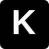

<div align="center">
  
  <h1 align="center">Krish Chourasia - Portfolio</h1>
  <h3>A Modern, Neo-Brutalist Developer Portfolio</h3>
</div>

<p align="center">
  <a href="https://portfolio-lovat-gamma-12.vercel.app/" target="_blank">
    
  </a>
</p>

<p align="center">
  
  
  
  
  
</p>

## ⚡ Overview

A high-performance, interactive portfolio website built to showcase web development and design skills. It features a bold, **Neo-Brutalist** aesthetic—combining hard shadows, distinct borders, and high contrast with fluid, modern animations.

## ✨ Key Features

- **🎨 Neo-Brutalist Design System**: Custom Tailwind configuration for consistent brutalist shadows, robust borders, and sharp typography.
- **🚀 Advanced Animations**: Complex page transitions and a staggered custom curtain loading sequence powered by **Framer Motion**.
- **📜 Smooth Scrolling**: Integrated **Lenis** for seamless momentum-based scrolling, synced flawlessly with element tracking.
- **🖱️ Magnetic Elements**: Custom interactive hooks making buttons follow the cursor for a premium, tactile user experience.
- **🌗 Theme Toggle**: Dynamic Dark/Light mode switching.
- **📧 Serverless Contact Form**: Fully functional contact form powered by **EmailJS**.

## 🛠️ Tech Stack

| Category | Technology |
|----------|------------|
| **Frontend** | React 18, TypeScript |
| **Build Tool** | Vite |
| **Styling** | Tailwind CSS 3.4 |
| **Animation** | Framer Motion |
| **Icons** | Lucide React |
| **Scrolling** | Lenis |
| **Forms** | EmailJS |

## 🚀 Getting Started

Follow these steps to run the project locally on your machine.

### Prerequisites

- **Node.js** (v18 or higher recommended)
- **npm** or **yarn**

### Installation

1.  **Clone the repository**
    ```bash
    git clone https://github.com/Frostt-Dev/Portfolio.git
    cd Portfolio
    ```

2.  **Install dependencies**
    ```bash
    npm install
    ```

3.  **Environment Setup**
    Create a `.env` file in the root directory and add your keys:
    ```env
    VITE_EMAILJS_SERVICE_ID=your_service_id
    VITE_EMAILJS_TEMPLATE_ID=your_template_id
    VITE_EMAILJS_PUBLIC_KEY=your_public_key
    ```

4.  **Start the Development Server**
    ```bash
    npm run dev
    ```
    The application will start on `http://localhost:5173/`.

## 📂 Project Structure

```bash
src/
├── assets/           # Static assets, images, and brand files
├── components/       # Reusable UI components (Magnetic, Navbar, Hero, LoadingScreen)
├── pages/            # Page layouts (Home, ProjectsPage)
├── App.tsx           # Main application routing and core providers
├── index.css         # Global styles & Neo-brutalist Theme variables
└── main.tsx          # React application entry point
```

## 📄 License
This project is licensed under the **MIT License**.

---
*Built with ❤️ by Krish Chourasia.*